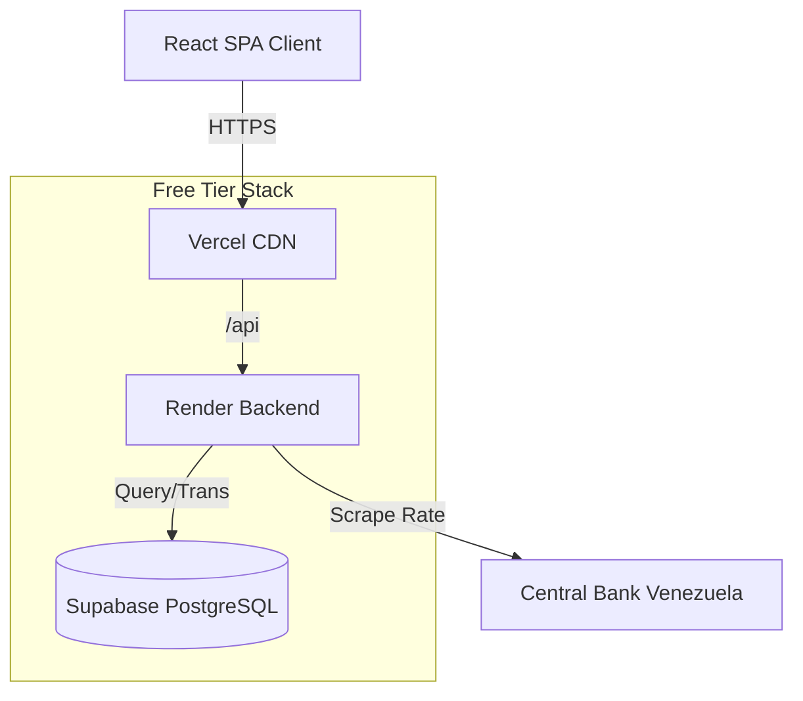

<div align="center">

# 💰 Personal Finance Manager
### Multi-Currency Financial Management System

[](README.en.md)
[](README.md)

[](https://vercel.com/)
[](https://render.com/)
[](https://supabase.com/)
[](https://reactjs.org/)
[](https://nodejs.org/)

**A robust financial management solution tailored for high-inflation economies.**
Seamlessly integrates automatic currency conversion (USD/VES), scalable architecture, Enterprise-grade security, and a modern responsive design.

[Technical Features](#-technical-features) •
[Architecture](#-system-architecture) •
[Tech Stack](#-tech-stack) •
[Installation](#-quick-start) •
[Roadmap](#-roadmap)

</div>

---

## 🚀 Value Proposition

This project is not just another expense tracker. It is a **full-stack architectural solution** designed to solve a real-world problem: financial management in complex bi-monetary environments.

Unlike traditional apps, this system handles the **Dollar/Bolivar** duality in real-time, automatically synchronizing official rates (Central Bank) and enabling accurate financial reporting regardless of the original transaction currency.

## ✨ Technical Features

### 💵 Dual Currency Engine
*   **Real-Time Conversion**: Currency-agnostic system. Transactions are stored in their source currency and normalized for reporting using precise historical rates.
*   **Automatic Synchronization**: A background service (`node-cron`) fetches and updates the Central Bank (BCV) exchange rate three times daily.
*   **Decimal Precision**: Utilizes `Decimal.js` for floating-point arithmetic precision in critical financial calculations.

### ☁️ Cloud-Native Architecture (Free Tier)
*   **Vercel**: React frontend deployed with global CDN and automatic CI/CD.
*   **Render**: Node.js backend with automatic deployment from GitHub.
*   **Supabase**: Managed PostgreSQL with automatic backups.
*   **Total Cost**: $0/month on free tier.

### 🛡️ Security & Performance
*   **Robust Authentication**: JWT with token rotation and `httpOnly` cookies to mitigate XSS attacks.
*   **Rate Limiting**: Protection against brute-force attacks with IPv6 support.
*   **Query Optimization**: Leverages `Prisma Aggregate` for database-level balance calculations.

---

## 🏗 System Architecture



---

## 🛠 Tech Stack

### Frontend (Client)
*   **Framework**: React 18 + Vite (High-performance SPA)
*   **Styling**: TailwindCSS (Utility-first responsive design)
*   **State Management**: React Context API + Axios Interceptors
*   **UX**: Glassmorphism Design, Dark/Light Mode

### Backend (API)
*   **Runtime**: Node.js v20 (LTS)
*   **Framework**: Express.js (REST API)
*   **ORM**: Prisma (Type-safe with migrations)
*   **Services**: `node-cron`, `cheerio` (BCV Scraping), `zod` (Validation)

### Infrastructure
*   **Frontend**: Vercel (CDN + CI/CD)
*   **Backend**: Render (Node.js hosting)
*   **Database**: Supabase (Managed PostgreSQL)
*   **Containers**: Docker (for local development)

---

## 🚀 Quick Start

### Prerequisites
*   Node.js v20+
*   Docker & Docker Compose (Optional)

### 1. Clone the repository
```bash
git clone https://github.com/Gillardo/personal-finance-app.git
cd personal-finance-app
```

### 2. Environment Setup
```bash
cd server && cp .env.example .env
# Edit DATABASE_URL and JWT_SECRET
```

### 3. Start with Docker (Recommended)
```bash
docker compose up -d
```
Access the frontend at `http://localhost:5173`.

### 4. Cloud Deployment
Refer to the detailed guide: [`docs/DEPLOY_CLOUD.md`](docs/DEPLOY_CLOUD.md)

---

## 🗺 Roadmap

- [ ] **Native Mobile App**: React Native for iOS/Android
- [ ] **Artificial Intelligence**: LLM integration for expense analysis ("Financial Copilot")
- [ ] **Open Banking Integration**: Automatic bank connections for transaction importing
- [ ] **Investment Module**: Real-time stock and crypto portfolio tracking

---

<div align="center">
  
**Developed by Jeremy**
  
[GitHub](https://github.com/Gillardo)

</div>
