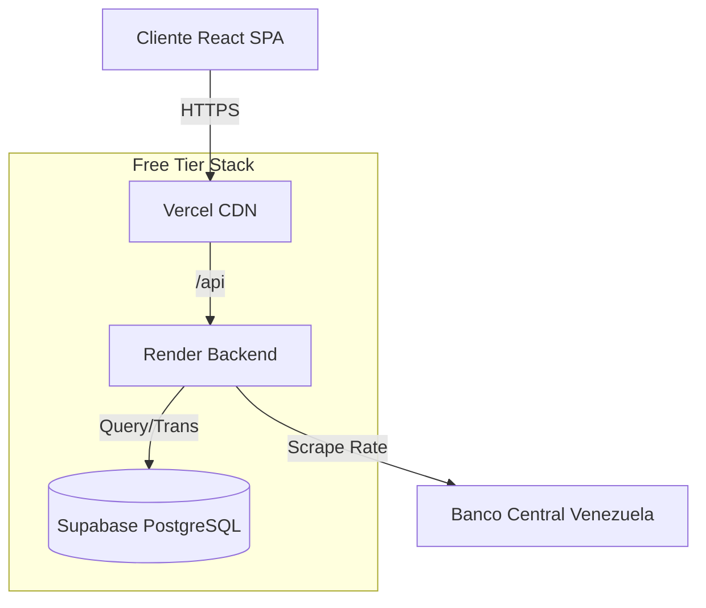

<div align="center">

# 💰 Tu Gestor de Finanzas
### Sistema de Gestión Financiera Multi-Moneda

[](README.en.md)
[](README.md)

[](https://vercel.com/)
[](https://render.com/)
[](https://supabase.com/)
[](https://reactjs.org/)
[](https://nodejs.org/)

**Una solución robusta para la gestión financiera en economías de alta inflación.**
Integra conversión automática de divisas (USD/VES), arquitectura escalable, seguridad Enterprise, y un diseño responsive moderno.

[Características](#-características-técnicas) •
[Arquitectura](#-arquitectura-del-sistema) •
[Stack](#-stack-tecnológico) •
[Instalación](#-instalación-rápida) •
[Roadmap](#-roadmap)

</div>

---

## 🚀 Propuesta de Valor

Este proyecto no es solo una calculadora de gastos. Es una **arquitectura completa full-stack** diseñada para resolver un problema real: la gestión financiera en entornos bi-monetarios complejos.

A diferencia de apps tradicionales, este sistema maneja la dualidad **Dólar/Bolívar** en tiempo real, sincronizando tasas oficiales (BCV) automáticamente y permitiendo reportes financieros precisos sin importar la moneda de la transacción original.

## ✨ Características Técnicas

### 💵 Motor Multi-Moneda (Dual Currency Engine)
*   **Conversión en Tiempo Real**: Sistema agnóstico a la moneda. Las transacciones se guardan en su moneda original y se normalizan para reportes usando tasas históricas exactas.
*   **Sincronización Automática**: Un servicio en background (`node-cron`) obtiene y actualiza la tasa del Banco Central de Venezuela (BCV) tres veces al día.
*   **Precisión Decimal**: Manejo de montos con `Decimal.js` para evitar errores de punto flotante en cálculos financieros críticos.

### ☁️ Arquitectura Cloud-Native (Free Tier)
*   **Vercel**: Frontend React desplegado con CDN global y CI/CD automático.
*   **Render**: Backend Node.js con despliegue automático desde GitHub.
*   **Supabase**: PostgreSQL gestionado con backups automáticos.
*   **Costo Total**: $0/mes en free tier.

### 🛡️ Seguridad & Rendimiento
*   **Autenticación Robusta**: JWT con rotación de tokens y cookies `httpOnly` para mitigar XSS.
*   **Rate Limiting**: Protección contra ataques de fuerza bruta con soporte para IPv6.
*   **Optimización de Consultas**: Uso de `Prisma Aggregate` para cálculos de balance en base de datos.

---

## 🏗 Arquitectura del Sistema



---

## 🛠 Stack Tecnológico

### Frontend (Cliente)
*   **Framework**: React 18 + Vite (SPA de alto rendimiento)
*   **Estilos**: TailwindCSS (Sistema de diseño responsive)
*   **Estado**: React Context API + Axios Interceptors
*   **UX**: Diseño Glassmorphism, Modo Oscuro/Claro

### Backend (API)
*   **Runtime**: Node.js v20 (LTS)
*   **Framework**: Express.js (REST API)
*   **ORM**: Prisma (Type-safe con migraciones)
*   **Servicios**: `node-cron`, `cheerio` (Scraping BCV), `zod` (Validación)

### Infraestructura
*   **Frontend**: Vercel (CDN + CI/CD)
*   **Backend**: Render (Node.js hosting)
*   **Database**: Supabase (PostgreSQL managed)
*   **Contenedores**: Docker (para desarrollo local)

---

## 🚀 Instalación Rápida

### Prerrequisitos
*   Node.js v20+
*   Docker & Docker Compose (Opcional)

### 1. Clonar el repositorio
```bash
git clone https://github.com/Gillardo/personal-finance-app.git
cd personal-finance-app
```

### 2. Configuración de Entorno
```bash
cd server && cp .env.example .env
# Edita DATABASE_URL y JWT_SECRET
```

### 3. Iniciar con Docker (Recomendado)
```bash
docker compose up -d
```
El frontend estará en `http://localhost:5173`.

### 4. Despliegue en la Nube
Consulta la guía detallada: [`docs/DEPLOY_CLOUD.md`](docs/DEPLOY_CLOUD.md)

---

## 🗺 Roadmap

- [ ] **App Móvil Nativa**: React Native para iOS/Android
- [ ] **Inteligencia Artificial**: Análisis de gastos con LLMs ("Financial Copilot")
- [ ] **Integración Bancaria**: Conexión automática con bancos (Open Banking)
- [ ] **Módulo de Inversiones**: Seguimiento de portafolio en tiempo real

---

<div align="center">
  
**Desarrollado por Jeremy**
  
[GitHub](https://github.com/Gillardo)

</div>
