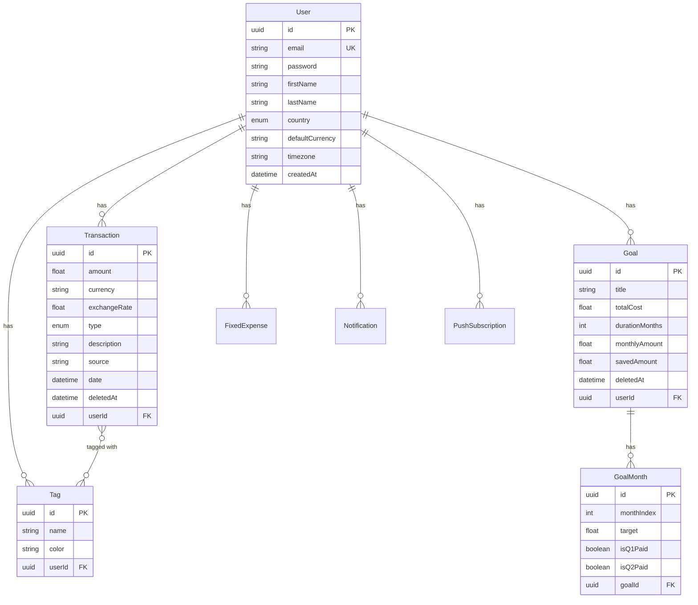
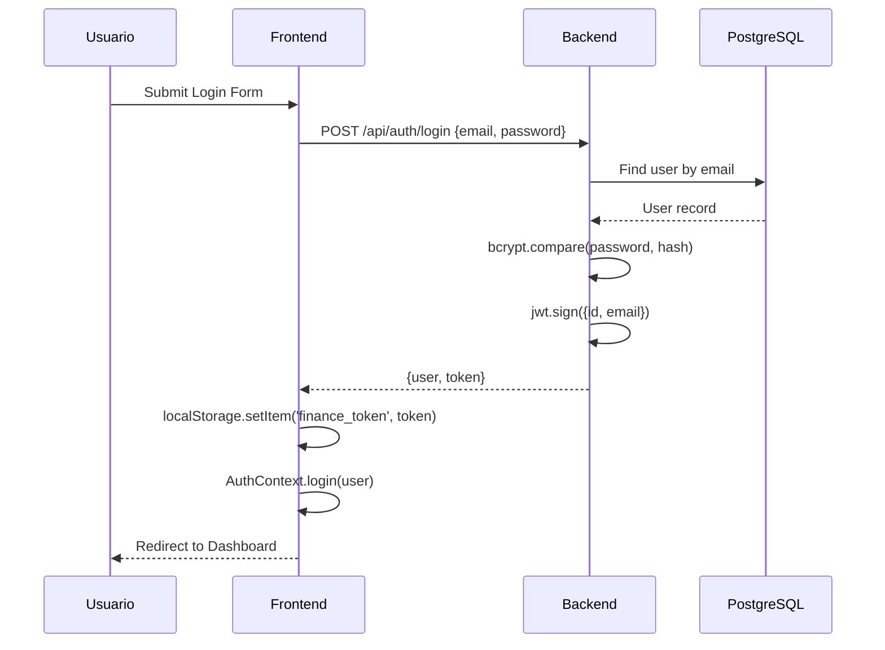
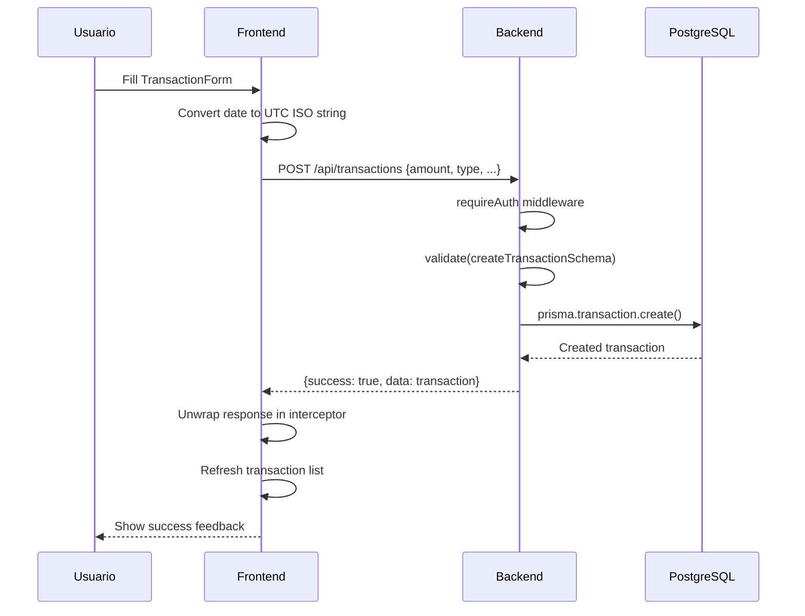
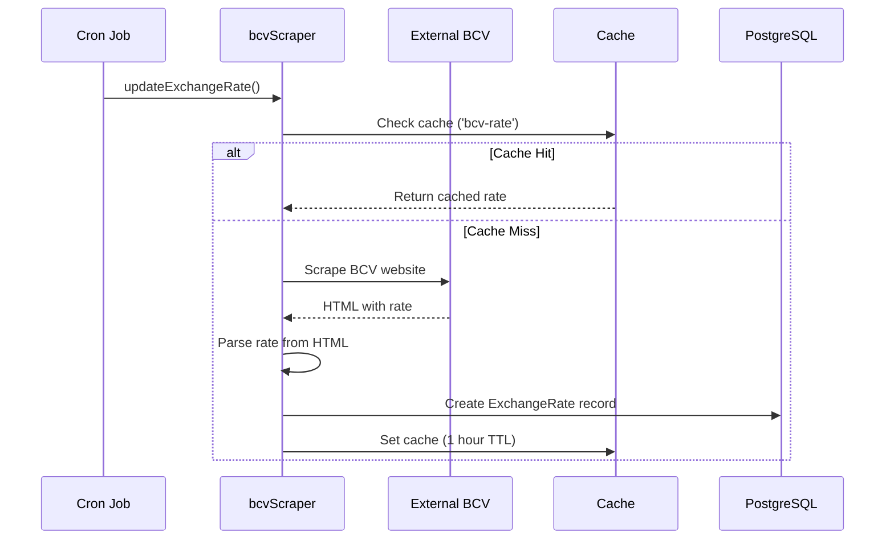

# 📐 Arquitectura del Sistema - Gestor Financiero Personal

## Tabla de Contenidos
1. [Visión General](#visión-general)
2. [Objetivos del Sistema](#objetivos-del-sistema)
3. [Funcionalidades](#funcionalidades)
4. [Stack Tecnológico](#stack-tecnológico)
5. [Arquitectura del Sistema](#arquitectura-del-sistema)
6. [Modelo de Datos](#modelo-de-datos)
7. [Backend - API REST](#backend---api-rest)
8. [Frontend - SPA React](#frontend---spa-react)
9. [Seguridad](#seguridad)
10. [Patrones de Diseño](#patrones-de-diseño)
11. [Flujos de Datos](#flujos-de-datos)
12. [Infraestructura y Despliegue](#infraestructura-y-despliegue)

---

## Visión General

**Gestor Financiero Personal** es una aplicación web progresiva (PWA) diseñada para la gestión de finanzas personales con soporte multi-país y multi-moneda. La arquitectura sigue un patrón cliente-servidor con separación clara de responsabilidades.

### Propósito
Proveer una herramienta completa para que usuarios de Latinoamérica y Estados Unidos puedan:
- Controlar sus ingresos y gastos diarios
- Planificar metas de ahorro a largo plazo
- Visualizar su salud financiera en tiempo real
- Manejar múltiples monedas (especialmente útil para Venezuela con USD/VES)

### Características Arquitectónicas Clave
- **Multi-tenancy por usuario**: Cada usuario tiene datos completamente aislados
- **Multi-país**: Soporte para VE, CO, CL, MX, AR, US con monedas locales
- **Dual Currency (Venezuela)**: Manejo especial de USD + VES con tasa BCV
- **Soft Delete**: Las transacciones y metas usan eliminación lógica
- **RESTful API**: Comunicación cliente-servidor via HTTP/JSON

---

## Objetivos del Sistema

### Objetivos de Negocio
| Objetivo | Descripción | Métrica de Éxito |
|----------|-------------|------------------|
| **Accesibilidad** | Disponible 24/7 desde cualquier dispositivo | PWA instalable, responsive design |
| **Multi-región** | Servir usuarios de 6 países latinoamericanos + US | Configuración por país con monedas locales |
| **Facilidad de uso** | Interfaz intuitiva sin curva de aprendizaje | Registro en <1 min, primera transacción en <30s |
| **Seguridad** | Proteger datos financieros sensibles | Autenticación JWT, bcrypt, HTTPS |

### Objetivos Técnicos
| Objetivo | Implementación |
|----------|----------------|
| **Escalabilidad** | Arquitectura containerizada en Azure |
| **Mantenibilidad** | Código modular, validación centralizada |
| **Rendimiento** | Cache de tasa BCV, paginación, lazy loading |
| **Disponibilidad** | Health checks, graceful shutdown |

### Objetivos de Usuario (User Stories)

```
Como usuario venezolano,
Quiero registrar gastos en USD y VES
Para ver mi balance total en ambas monedas con tasa BCV actualizada

Como usuario colombiano,
Quiero controlar mis gastos mensuales en COP
Para no exceder mi presupuesto

Como cualquier usuario,
Quiero crear metas de ahorro
Para planificar compras grandes con sistema de quincenas
```

---

## Funcionalidades

### 1. 🔐 Autenticación y Gestión de Usuarios

| Funcionalidad | Descripción | Componentes Involucrados |
|---------------|-------------|--------------------------|
| **Registro** | Email + contraseña + país | `RegisterPage.jsx` → `POST /api/auth/register` |
| **Login** | Autenticación con JWT (7 días) | `LoginPage.jsx` → `POST /api/auth/login` |
| **Sesión persistente** | Token en localStorage | `AuthContext.jsx` + Axios interceptor |
| **Logout** | Limpieza de datos locales | `AuthContext.logout()` |
| **Multi-país** | VE, CO, CL, MX, AR, US | `countries.js` config |

**Flujo de Registro:**
```
Usuario → Selecciona país → Ingresa datos → Sistema asigna moneda por defecto
    VE → USD (dual: USD + VES)
    CO → COP
    CL → CLP
    MX → MXN
    AR → ARS
    US → USD
```

### 2. 💰 Gestión de Transacciones

| Funcionalidad | Descripción | Endpoint |
|---------------|-------------|----------|
| **Crear ingreso/gasto** | Monto, moneda, descripción, fuente, fecha, etiquetas | `POST /api/transactions` |
| **Listar transacciones** | Paginado, filtrable por tipo | `GET /api/transactions?page=1&type=EXPENSE` |
| **Editar transacción** | Modificar cualquier campo | `PUT /api/transactions/:id` |
| **Eliminar (soft)** | Marca deletedAt, no borra | `DELETE /api/transactions/:id` |
| **Transacciones recientes** | Últimas 10 para dashboard | `GET /api/transactions/recent` |

**Campos de Transacción:**
- `amount`: Monto positivo (requerido)
- `currency`: USD, VES, COP, CLP, MXN, ARS
- `type`: INCOME | EXPENSE
- `description`: Texto descriptivo (requerido)
- `source`: Origen del dinero (ej: "Banesco", "Zelle")
- `date`: Fecha/hora (UTC ISO string)
- `exchangeRate`: Tasa USD→VES (solo Venezuela)
- `tags`: Array de IDs de etiquetas

### 3. 📊 Dashboard y Balance

| Funcionalidad | Descripción | Vista |
|---------------|-------------|-------|
| **Balance general** | Total ingresos - gastos por moneda | Tarjeta principal |
| **Balance dual (VE)** | USD + VES equivalente | Dashboard Venezuela |
| **Balance simple** | Moneda única local | Dashboard otros países |
| **Tasa BCV** | Tasa oficial USD/VES actualizada | Tarjeta lateral (solo VE) |
| **Transacciones recientes** | Últimos movimientos | Lista inferior |
| **Indicador negativo** | Estilos rojos si balance < 0 | Condicional visual |

**Cálculo de Balance:**
```javascript
// Por moneda
balance[currency] = sum(INCOME) - sum(EXPENSE)

// Venezuela: Conversión a USD
veBalanceUSD = balanceUSD + (balanceVES / tasaBCV)
```

### 4. 🏷️ Sistema de Etiquetas

| Funcionalidad | Descripción | Endpoint |
|---------------|-------------|----------|
| **Crear etiqueta** | Nombre + color | `POST /api/tags` |
| **Listar etiquetas** | Todas del usuario | `GET /api/tags` |
| **Eliminar etiqueta** | Desvincula de transacciones | `DELETE /api/tags/:id` |
| **Asignar a transacción** | Relación many-to-many | En creación/edición |
| **Ver transacciones por etiqueta** | Filtrado | `GET /api/tags/:id/transactions` |

**Colores Disponibles:** blue, red, green, yellow, purple, pink, indigo, gray

### 5. 🎯 Metas de Ahorro

| Funcionalidad | Descripción | Endpoint |
|---------------|-------------|----------|
| **Crear meta** | Título, costo total, ahorro mensual | `POST /api/goals` |
| **Sistema de quincenas** | 2 pagos por mes (Q1, Q2) | Modelo GoalMonth |
| **Marcar pago** | Toggle Q1/Q2 como pagado | `PUT /api/goals/:goalId/toggle-month` |
| **Progreso visual** | Barra de progreso | GoalDetailPage |
| **Duración automática** | totalCost / monthlyAmount | Calculado |

**Modelo de Quincenas:**
```
Meta: $1200 en 12 meses = $100/mes = $50 x quincena

Mes 1: [Q1: ✓ $50] [Q2: ✗ $50]
Mes 2: [Q1: ✗ $50] [Q2: ✗ $50]
...
```

### 6. 📅 Gastos Fijos

| Funcionalidad | Descripción | Endpoint |
|---------------|-------------|----------|
| **Crear gasto fijo** | Descripción, monto, día de vencimiento | `POST /api/fixed-expenses` |
| **Listar gastos fijos** | Todos del usuario | `GET /api/fixed-expenses` |
| **Recordatorios** | Notificaciones 5, 3, 1 día antes | Cron job |
| **Activar/desactivar** | Toggle isActive | `PUT /api/fixed-expenses/:id` |

### 7. 💱 Tasa de Cambio BCV

| Funcionalidad | Descripción | Implementación |
|---------------|-------------|----------------|
| **Scraping BCV** | Obtiene tasa oficial | `bcvScraper.js` |
| **Cache 1 hora** | Evita requests excesivos | `cacheService.js` |
| **Actualización programada** | 3 veces al día (8am, 4pm, 12am) | `node-cron` |
| **Fallback** | Última tasa guardada en DB | `ExchangeRate` model |
| **Endpoint público** | Sin auth requerido | `GET /api/exchange-rate/usd-ves` |

### 8. 🔔 Sistema de Notificaciones

| Funcionalidad | Descripción | Endpoint |
|---------------|-------------|----------|
| **Recordatorio de quincena** | Notifica pago de meta pendiente | Cron job |
| **Gasto fijo próximo** | 5, 3, 1 día antes del vencimiento | Cron job |
| **Listar notificaciones** | Todas del usuario | `GET /api/notifications` |
| **Marcar como leída** | Toggle isRead | `PUT /api/notifications/:id` |
| **Push notifications** | Web Push API | `PushSubscription` model |

### 9. 📈 Insights y Análisis

| Funcionalidad | Descripción | Endpoint |
|---------------|-------------|----------|
| **Resumen mensual** | Ingresos vs gastos del mes | `GET /api/insight/monthly` |
| **Gastos por categoría** | Agrupado por etiquetas | `GET /api/insight/by-category` |
| **Tendencia** | Comparación con mes anterior | Cálculo frontend |

### 10. 📱 Experiencia de Usuario

| Funcionalidad | Descripción | Implementación |
|---------------|-------------|----------------|
| **PWA** | Instalable en móvil | Service Worker + manifest |
| **Responsive** | Mobile-first design | Tailwind breakpoints |
| **Dark/Light mode** | Variables CSS | `index.css` theming |
| **Swipe to delete** | Gesto táctil | `TransactionItem.jsx` |
| **Loading states** | Spinners y skeletons | `LoadingSpinner.jsx` |
| **Error boundaries** | Captura errores de UI | `ErrorBoundary.jsx` |
| **Internacionalización** | Textos en español | `i18n/es.js` |

---


## Stack Tecnológico

### Backend
| Componente | Tecnología | Versión | Propósito |
|------------|------------|---------|-----------|
| Runtime | Node.js | 20+ | Entorno de ejecución |
| Framework | Express.js | 4.x | Servidor HTTP y routing |
| ORM | Prisma | 5.x | Acceso a base de datos |
| Base de Datos | PostgreSQL | 15+ | Almacenamiento persistente |
| Validación | Zod | 3.x | Validación de esquemas |
| Autenticación | JWT + bcrypt | - | Tokens y hashing |
| Logging | Winston | 3.x | Sistema de logs estructurados |
| Scheduler | node-cron | 3.x | Tareas programadas |
| Cache | node-cache | 5.x | Cache en memoria |

### Frontend
| Componente | Tecnología | Versión | Propósito |
|------------|------------|---------|-----------|
| Framework | React | 18.x | UI Components |
| Build Tool | Vite | 5.x | Bundling y HMR |
| HTTP Client | Axios | 1.x | Comunicación API |
| Routing | React Router | 6.x | Navegación SPA |
| Estilos | Tailwind CSS | 3.x | Utility-first CSS |
| Iconos | Lucide React | - | Iconografía SVG |

### Infraestructura
| Componente | Tecnología | Propósito |
|------------|------------|-----------|
| Contenedores | Docker | Empaquetado |
| Orquestación | Docker Compose | Desarrollo local |
| Cloud | Azure Container Apps | Producción |
| Registry | Azure Container Registry | Almacén de imágenes |
| DB Cloud | Azure PostgreSQL Flexible | DB productiva |
| Reverse Proxy | Nginx | Servir frontend |

---

## Arquitectura del Sistema

```
┌─────────────────────────────────────────────────────────────────────────┐
│                              INTERNET                                    │
└─────────────────────────────┬───────────────────────────────────────────┘
                              │
                              ▼
┌─────────────────────────────────────────────────────────────────────────┐
│                    Azure Container Apps Environment                      │
│                                                                          │
│  ┌─────────────────────────┐     ┌─────────────────────────────────┐   │
│  │   finanzas-frontend     │     │       finanzas-backend          │   │
│  │   (Nginx + React SPA)   │────▶│       (Node.js + Express)       │   │
│  │   Port: 80              │     │       Port: 3000                │   │
│  └─────────────────────────┘     └───────────────┬─────────────────┘   │
│                                                   │                      │
└───────────────────────────────────────────────────┼──────────────────────┘
                                                    │
                                                    ▼
                              ┌─────────────────────────────────────┐
                              │   Azure PostgreSQL Flexible Server  │
                              │        (finanzas-postgres)          │
                              └─────────────────────────────────────┘
```

### Flujo de Request

```
Browser → Nginx (Frontend) → /api/* proxy → Express (Backend) → Prisma → PostgreSQL
```

---

## Modelo de Datos

### Diagrama Entidad-Relación



### Enums del Sistema

```prisma
enum Country {
  VE  // Venezuela - Dual currency (USD + VES)
  CO  // Colombia - COP only
  CL  // Chile - CLP only
  MX  // Mexico - MXN only
  AR  // Argentina - ARS only
  US  // USA - USD only
}
```

### Índices de Base de Datos

| Tabla | Índice | Campos | Propósito |
|-------|--------|--------|-----------|
| Transaction | idx_user_date | userId, date | Consultas por período |
| Transaction | idx_user_type | userId, type | Filtrado INCOME/EXPENSE |
| Transaction | idx_user_deleted | userId, deletedAt | Soft delete queries |
| FixedExpense | idx_user_due | userId, dueDay | Recordatorios |
| Goal | idx_user_deleted | userId, deletedAt | Soft delete queries |
| Notification | idx_user_read | userId, isRead | Notificaciones no leídas |

---

## Backend - API REST

### Estructura de Directorios

```
server/
├── index.js              # Entry point, middleware stack
├── db.js                 # Prisma client export
├── routes/               # Route handlers
│   ├── auth.js           # /api/auth (register, login)
│   ├── users.js          # /api/users (legacy)
│   ├── transactions.js   # /api/transactions
│   ├── tags.js           # /api/tags
│   ├── fixedExpenses.js  # /api/fixed-expenses
│   ├── goals.js          # /api/goals
│   ├── insight.js        # /api/insight
│   ├── notifications.js  # /api/notifications
│   └── exchangeRate.js   # /api/exchange-rate
├── middleware/
│   ├── requireAuth.js    # JWT authentication
│   ├── errorHandler.js   # Global error handling
│   └── currencyEnforcer.js # Currency validation
├── schemas/
│   └── index.js          # Zod validation schemas
├── services/
│   ├── bcvScraper.js     # BCV rate scraping
│   └── cacheService.js   # In-memory cache
├── utils/
│   ├── logger.js         # Winston configuration
│   ├── responseUtils.js  # Standardized responses
│   └── pagination.js     # Pagination helpers
├── cron/
│   └── reminderJobs.js   # Scheduled notifications
└── prisma/
    ├── schema.prisma     # Database schema
    └── migrations/       # Migration history
```

### Endpoints API

#### Autenticación (`/api/auth`)
| Método | Ruta | Body | Respuesta | Descripción |
|--------|------|------|-----------|-------------|
| POST | `/register` | `{email, password, firstName, lastName, country?}` | `{user, token}` | Registro |
| POST | `/login` | `{email, password}` | `{user, token}` | Login |
| GET | `/me` | - | `{user}` | Usuario actual |

#### Transacciones (`/api/transactions`) 🔒
| Método | Ruta | Query/Body | Descripción |
|--------|------|------------|-------------|
| GET | `/` | `?page=1&limit=20&type=INCOME` | Listar con paginación |
| GET | `/balance` | - | Balance por moneda |
| GET | `/recent` | - | Últimas 10 transacciones |
| POST | `/` | `{amount, currency, type, description, ...}` | Crear |
| PUT | `/:id` | `{...fields}` | Actualizar |
| DELETE | `/:id` | - | Soft delete |

#### Formato de Respuesta

```javascript
// Éxito
{
  "success": true,
  "data": { ... },
  "message": "Operación exitosa",
  "error": null,
  "code": null
}

// Error
{
  "success": false,
  "data": null,
  "message": "Mensaje para el usuario",
  "error": "Mensaje para el usuario",
  "code": "ERROR_CODE",
  "status": 400
}
```

### Middleware Stack (Orden de Ejecución)

```javascript
1. helmet()           // Headers de seguridad
2. cors()             // Control de origen
3. express.json()     // Body parser
4. rateLimit()        // Solo en /api/users/verify
5. requireAuth        // En rutas protegidas
6. validate(schema)   // Validación Zod
7. Route Handler      // Lógica de negocio
8. errorHandler       // Captura errores
```

### Validación con Zod

```javascript
// Ejemplo: createTransactionSchema
const createTransactionSchema = z.object({
    amount: z.union([z.number(), z.string()])
        .transform(val => parseFloat(val))
        .pipe(positiveNumber),
    currency: z.enum(['USD', 'VES', 'COP', 'CLP', 'MXN', 'ARS']),
    type: z.enum(['INCOME', 'EXPENSE']),
    description: z.string().min(1).max(200),
    source: z.string().max(100).optional().nullable(),
    date: z.string().datetime().optional(),
    exchangeRate: z.union([z.number(), z.string()])
        .transform(val => val ? parseFloat(val) : null)
        .optional().nullable(),
    tags: z.array(uuid).optional().default([])
});
```

---

## Frontend - SPA React

### Estructura de Directorios

```
client/src/
├── main.jsx              # Entry point
├── App.jsx               # Router y providers
├── api.js                # Axios instance
├── config.js             # API_URL
├── index.css             # Tailwind + CSS vars
├── components/
│   ├── TransactionForm.jsx
│   ├── TransactionItem.jsx
│   ├── SummaryCard.jsx
│   ├── ErrorBoundary.jsx
│   ├── common/           # LoadingSpinner, Button, etc.
│   ├── layout/           # MainLayout, Sidebar, Header
│   └── ui/               # Componentes base
├── pages/
│   ├── LoginPage.jsx
│   ├── RegisterPage.jsx
│   ├── DashboardHelper.jsx
│   ├── TransactionsPage.jsx
│   ├── TagsPage.jsx
│   ├── BudgetPage.jsx
│   ├── GoalsPage.jsx
│   └── GoalDetailPage.jsx
├── context/
│   ├── AuthContext.jsx   # Estado de autenticación
│   └── TagsContext.jsx   # Cache de etiquetas
├── config/
│   └── countries.js      # Configuración multi-país
├── utils/
│   ├── formatters.js     # Formato de moneda/fecha
│   └── useTransactionDate.js
└── i18n/
    └── es.js             # Textos en español
```

### Jerarquía de Componentes

```
App.jsx
├── ErrorBoundary
│   └── AuthProvider
│       └── TagsProvider
│           └── Router
│               ├── LoginPage
│               ├── RegisterPage
│               └── ProtectedRoute
│                   └── MainLayout
│                       ├── Sidebar
│                       ├── Header
│                       └── [Page Content]
│                           ├── DashboardHelper
│                           ├── TransactionsPage
│                           │   └── TransactionItem[]
│                           ├── TagsPage
│                           ├── BudgetPage
│                           └── GoalsPage
```

### Contextos de React

#### AuthContext
```javascript
const AuthContext = createContext({
    user: null,           // Usuario actual
    token: null,          // JWT token
    loading: boolean,     // Estado de carga
    login: (email, password) => Promise,
    register: (data) => Promise,
    logout: () => void,
    updateUser: (userData) => void
});
```

#### TagsContext
```javascript
const TagsContext = createContext({
    tags: [],             // Lista de etiquetas
    loading: boolean,
    error: string|null,
    addTag: (tag) => void,
    removeTag: (tagId) => void,
    refreshTags: () => Promise
});
```

### Axios Interceptors

```javascript
// Request Interceptor
api.interceptors.request.use(config => {
    const token = localStorage.getItem('finance_token');
    if (token) {
        config.headers.Authorization = `Bearer ${token}`;
    }
    return config;
});

// Response Interceptor
api.interceptors.response.use(
    response => {
        // Unwrap {success, data} format
        if (response.data?.success) {
            response.data = response.data.data;
        }
        return response;
    },
    error => {
        // Handle 401 → redirect to login
        if (error.response?.status === 401) {
            localStorage.clear();
            window.location.href = '/';
        }
        return Promise.reject(apiError);
    }
);
```

---

## Seguridad

### Capas de Seguridad

```
┌────────────────────────────────────────────────┐
│ 1. HELMET - HTTP Security Headers             │
│    - X-Content-Type-Options: nosniff          │
│    - X-Frame-Options: DENY                    │
│    - X-XSS-Protection: 1; mode=block          │
└────────────────────────────────────────────────┘
                    ▼
┌────────────────────────────────────────────────┐
│ 2. CORS - Origin Validation                   │
│    - Whitelist de dominios permitidos         │
│    - Bloqueo de orígenes desconocidos         │
└────────────────────────────────────────────────┘
                    ▼
┌────────────────────────────────────────────────┐
│ 3. RATE LIMITING                              │
│    - 50 requests / 15 min en /api/users/verify│
└────────────────────────────────────────────────┘
                    ▼
┌────────────────────────────────────────────────┐
│ 4. JWT AUTHENTICATION                         │
│    - Token en Authorization: Bearer           │
│    - Expiración: 7 días                       │
│    - Secret: JWT_SECRET env var               │
└────────────────────────────────────────────────┘
                    ▼
┌────────────────────────────────────────────────┐
│ 5. ZOD VALIDATION                             │
│    - Sanitización de inputs                   │
│    - Validación de tipos                      │
└────────────────────────────────────────────────┘
                    ▼
┌────────────────────────────────────────────────┐
│ 6. OWNERSHIP CHECKS                           │
│    - Verificación userId en cada recurso      │
│    - Aislamiento de datos por usuario         │
└────────────────────────────────────────────────┘
```

### Manejo de Passwords

```javascript
// Registro: Hash con bcrypt (10 rounds)
const hashedPassword = await bcrypt.hash(password, 10);

// Login: Comparación segura
const isValid = await bcrypt.compare(inputPassword, user.password);
```

### JWT Token Structure

```javascript
// Payload
{
    id: "user-uuid",        // User ID
    email: "user@email.com",
    country: "VE",
    iat: 1703116800,        // Issued at
    exp: 1703721600         // Expires (7 days)
}
```

---

## Patrones de Diseño

### 1. Repository Pattern (Prisma)
Prisma actúa como capa de abstracción sobre la base de datos.

```javascript
// Uso directo del cliente Prisma
const transactions = await prisma.transaction.findMany({
    where: withSoftDelete({ userId: req.userId }),
    include: { tags: true }
});
```

### 2. Middleware Pattern (Express)
Cadena de responsabilidades para procesamiento de requests.

```javascript
router.post('/',
    requireAuth,              // Autenticación
    validate(createSchema),   // Validación
    async (req, res, next) => {  // Handler
        // Lógica de negocio
    }
);
```

### 3. Factory Pattern (Validation Middleware)
```javascript
const validate = (schema, source = 'body') => {
    return (req, res, next) => {
        const result = schema.parse(req[source]);
        req[source] = result;
        next();
    };
};
```

### 4. Observer Pattern (React Context)
```javascript
// Provider notifica a todos los consumers
<AuthProvider>
    <App /> {/* Todos los hijos reciben updates */}
</AuthProvider>
```

### 5. Interceptor Pattern (Axios)
Modificación transparente de requests/responses.

### 6. Soft Delete Pattern
```javascript
// Helper para queries
const withSoftDelete = (where) => ({
    ...where,
    deletedAt: null
});

// Delete = Update
await prisma.transaction.update({
    where: { id },
    data: { deletedAt: new Date() }
});
```

---

## Flujos de Datos

### Flujo de Autenticación



### Flujo de Creación de Transacción



### Flujo de Actualización de Tasa BCV



---

## Infraestructura y Despliegue

### Arquitectura Docker

```yaml
# docker-compose.yml (desarrollo)
services:
  postgres:
    image: postgres:15-alpine
    volumes:
      - postgres_data:/var/lib/postgresql/data
    
  backend:
    build: ./server
    depends_on: [postgres]
    environment:
      - DATABASE_URL
      - JWT_SECRET
    
  frontend:
    build: ./client
    depends_on: [backend]
```

### Pipeline de Despliegue

```
1. build-and-push.ps1
   ├── az acr login
   ├── docker build -t backend ./server
   ├── docker build -t frontend ./client
   └── docker push (ambas imágenes)

2. deploy-apps.ps1
   ├── az containerapp update --name finanzas-backend
   └── az containerapp update --name finanzas-frontend
```

### Variables de Entorno

| Variable | Ambiente | Descripción |
|----------|----------|-------------|
| `DATABASE_URL` | Server | Connection string PostgreSQL |
| `JWT_SECRET` | Server | Clave secreta para JWT |
| `PORT` | Server | Puerto del servidor (3000) |
| `CRON_ENABLED` | Server | Activar tareas programadas |
| `VITE_API_URL` | Client | URL del backend |

### Monitoreo

| Servicio | Herramienta | Propósito |
|----------|-------------|-----------|
| Backend Logs | Winston + Azure Logs | Errores y actividad |
| Frontend Errors | ErrorBoundary + Console | Errores de UI |
| Health Check | `/api/health` | Disponibilidad |

---

## Consideraciones para el Arquitecto

### Fortalezas del Sistema
1. ✅ Separación clara frontend/backend
2. ✅ Validación robusta con Zod
3. ✅ Autenticación JWT estándar
4. ✅ Soft delete para integridad de datos
5. ✅ Multi-tenancy por diseño
6. ✅ Logging estructurado

### Áreas de Mejora Potencial
1. ⚠️ No hay tests de integración automatizados
2. ⚠️ Falta sistema de migraciones versionadas
3. ⚠️ Cache distribuido (Redis) para escalabilidad
4. ⚠️ Queue system para tareas asíncronas
5. ⚠️ API versioning (/api/v1/)
6. ⚠️ Rate limiting más granular
7. ⚠️ Monitoring con métricas (Prometheus/Grafana)

### Compatibilidad con Patrones Empresariales
- **Microservicios**: El backend podría dividirse (auth, transactions, goals)
- **Event Sourcing**: Las transacciones son inmutables (soft delete)
- **CQRS**: Podría separarse lectura/escritura para balance
- **API Gateway**: Nginx podría expandirse con auth centralizado

---

*Documento generado: 2025-12-21*
*Versión: 2.0.0*
