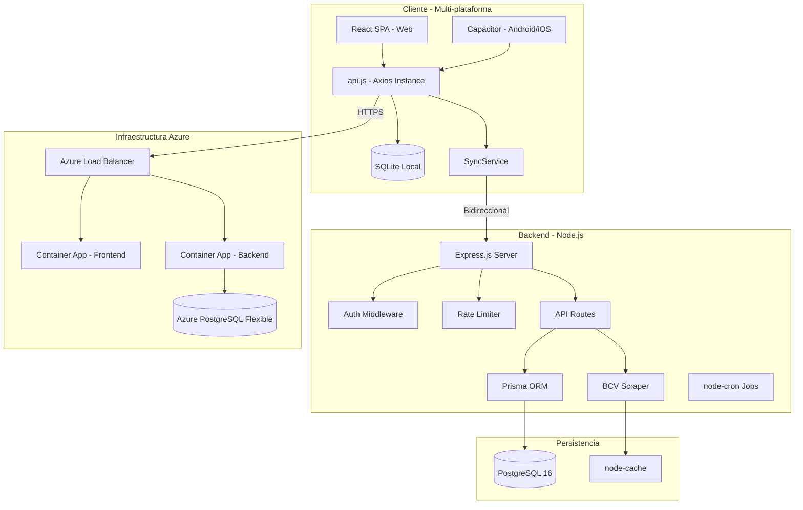
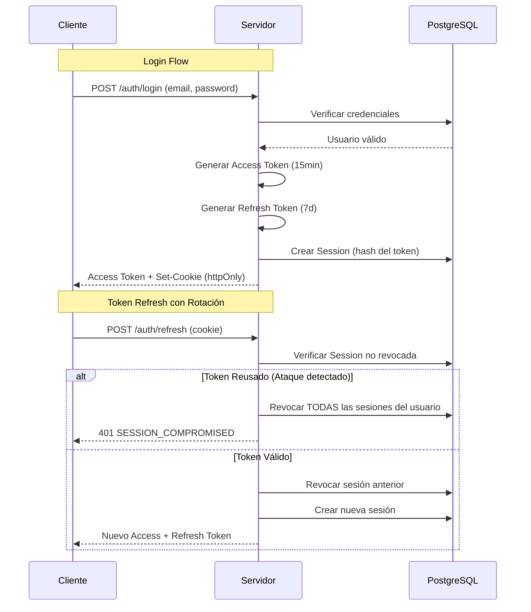
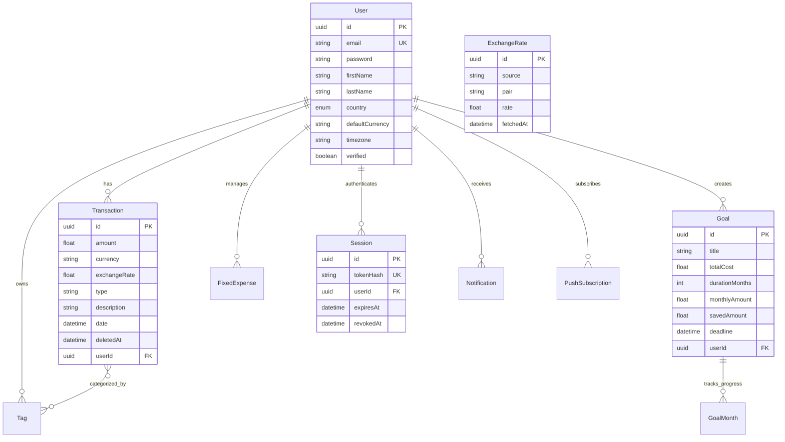
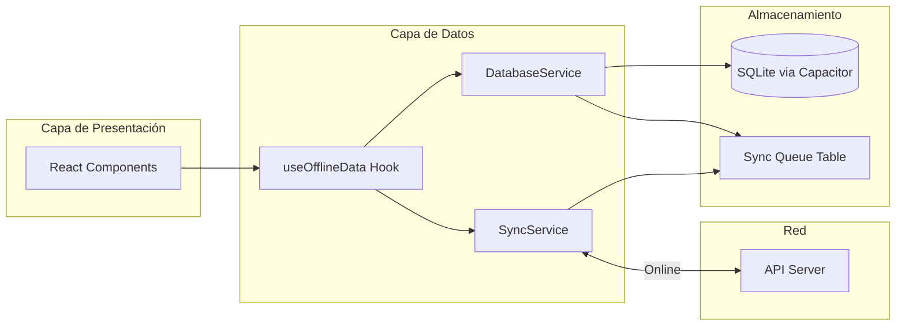

# 📊 Análisis de Arquitectura - Personal Finance App

## 🎯 Resumen Ejecutivo

Esta es una aplicación **fintech de budget tracking** diseñada específicamente para economías bi-monetarias (Venezuela USD/VES), con arquitectura cloud-native desplegable en Azure Container Apps. La aplicación sigue un patrón **monolito modular** con capacidades offline-first para móvil.

---

## 🏗️ Arquitectura General



---

## 📁 Estructura del Proyecto

```
personal-finance-app/
├── client/                    # Frontend React + Capacitor
│   ├── src/
│   │   ├── api.js            # Cliente HTTP centralizado
│   │   ├── App.jsx           # Router y providers
│   │   ├── components/       # Componentes reutilizables
│   │   ├── context/          # React Context (Auth, Tags)
│   │   ├── hooks/            # Custom hooks
│   │   ├── pages/            # Vistas principales
│   │   ├── services/         # Servicios (DB, Sync, Biometric)
│   │   └── utils/            # Utilidades
│   ├── android/              # Proyecto Android nativo
│   └── Dockerfile            # Build multi-stage
│
├── server/                    # Backend Node.js
│   ├── index.js              # Entry point
│   ├── routes/               # Endpoints REST
│   ├── middleware/           # Auth, CORS, Rate Limit
│   ├── services/             # Lógica de negocio
│   ├── prisma/               # Schema y migraciones
│   ├── cron/                 # Tareas programadas
│   └── Dockerfile
│
├── appuidesktop/             # Mockups HTML desktop
├── appuimobile/              # Mockups HTML mobile
└── docker-compose.yml        # Orquestación local
```

---

## 🔐 Arquitectura de Seguridad

### Sistema de Autenticación



### Capas de Seguridad Implementadas

| Capa | Implementación | Archivo |
|------|----------------|---------|
| **Autenticación** | JWT con rotación de refresh tokens | [`server/routes/auth.js`](../server/routes/auth.js) |
| **CSRF Protection** | Token en cookie + header validation | [`server/middleware/csrf.js`](../server/middleware/csrf.js) |
| **Rate Limiting** | 5 intentos/15min en auth endpoints | [`server/middleware/rateLimiter.js`](../server/middleware/rateLimiter.js) |
| **Headers HTTP** | Helmet.js (HSTS, CSP, X-Frame-Options) | [`server/index.js`](../server/index.js:57) |
| **Cookies Seguras** | httpOnly, Secure, SameSite=None | [`server/routes/auth.js`](../server/routes/auth.js:107) |
| **Validación** | Zod schemas en todos los endpoints | [`server/schemas/index.js`](../server/schemas/index.js) |

---

## 💾 Modelo de Datos



### Características del Modelo

- **Soft Delete**: Transacciones, Goals, FixedExpenses usan `deletedAt`
- **Multi-moneda**: Soporte para USD, VES, COP, CLP, MXN, ARS
- **Precisión Decimal**: Uso de `Decimal.js` para cálculos financieros
- **Índices Optimizados**: En `userId`, `date`, `type`, `deletedAt`

---

## 🌐 API REST

### Endpoints Principales

| Módulo | Endpoint | Descripción |
|--------|----------|-------------|
| **Auth** | `POST /api/auth/login` | Autenticación |
| | `POST /api/auth/register` | Registro |
| | `POST /api/auth/refresh` | Renovar token |
| | `GET /api/auth/me` | Perfil actual |
| **Transactions** | `GET /api/transactions` | Listar con paginación |
| | `GET /api/transactions/balance` | Balance polimórfico |
| | `POST /api/transactions` | Crear transacción |
| **Goals** | `GET /api/goals` | Metas de ahorro |
| | `POST /api/goals/:id/pay` | Registrar pago quincenal |
| **Exchange Rate** | `GET /api/exchange-rate/usd-ves` | Tasa BCV actual |
| **Insight** | `GET /api/insight/summary` | Resumen 30 días |

### Formato de Respuesta Estandarizado

```javascript
// Éxito
{
  "success": true,
  "data": { ... },
  "pagination": { "page": 1, "limit": 20, "total": 100 }
}

// Error
{
  "success": false,
  "error": "Mensaje descriptivo",
  "code": "VALIDATION_ERROR"
}
```

---

## 📱 Arquitectura Offline-First (Mobile)



### Flujo de Sincronización

1. **Operación Local**: Usuario crea transacción → Se guarda en SQLite con `syncStatus: 'pending'`
2. **Cola de Sync**: Se añade entrada a `sync_queue` con operación y payload
3. **Detección de Red**: `Network.addListener` detecta conectividad
4. **Upload**: `SyncService.uploadPendingChanges()` procesa la cola
5. **Download**: `SyncService.downloadServerChanges()` obtiene datos del servidor
6. **Resolución**: Last-write-wins para conflictos

---

## ⚙️ Servicios Clave

### 1. BCV Scraper Service

```javascript
// server/services/bcvScraper.js
- Scraping de tasa oficial USD/VES del Banco Central
- Retry con backoff exponencial (3 intentos)
- Cache en memoria (1 hora TTL)
- Cron job: 8:00, 16:00, 00:00 (hora Venezuela)
```

### 2. Cache Service

```javascript
// server/services/cacheService.js
- node-cache para datos frecuentes
- Invalidación manual en updates
- TTL configurable por key
```

### 3. Notification Service

```javascript
// client/src/services/NotificationService.js
- Push notifications via web-push
- Local notifications via Capacitor
- Recordatorios de gastos fijos
```

---

## 🚀 DevOps y Despliegue

### Docker Multi-Stage Build

```dockerfile
# Frontend (client/Dockerfile)
FROM node:20-alpine AS builder
# Build React app
FROM nginx:alpine
# Serve static files

# Backend (server/Dockerfile)
FROM node:20-alpine
# Run Express server
```

### Configuración de Contenedores

```yaml
# docker-compose.yml
services:
  postgres:    # PostgreSQL 16 Alpine
  backend:     # Node.js API (puerto 3000)
  frontend:    # Nginx (puerto 80)
```

### Variables de Entorno Críticas

| Variable | Descripción |
|----------|-------------|
| `DATABASE_URL` | Connection string PostgreSQL |
| `JWT_SECRET` | Secreto para firmar tokens |
| `CORS_ALLOWED_ORIGINS` | Orígenes permitidos |
| `VAPID_PUBLIC_KEY` | Push notifications |
| `CRON_ENABLED` | Habilitar tareas programadas |

---

## 📊 Patrones de Diseño Identificados

| Patrón | Uso | Ubicación |
|--------|-----|-----------|
| **Repository** | Prisma como abstracción de DB | Todas las rutas |
| **Middleware Chain** | Auth → Validation → Handler | Express routes |
| **Singleton** | DatabaseService, SyncService | Client services |
| **Observer** | SyncService listeners | Network status |
| **Strategy** | Respuesta polimórfica por país | `/transactions/balance` |
| **Soft Delete** | Preservar datos eliminados | Transactions, Goals |

---

## 🔍 Fortalezas de la Arquitectura

1. **Seguridad Enterprise**: Token rotation, CSRF, rate limiting
2. **Multi-moneda Real**: Conversión USD/VES con tasa oficial
3. **Offline-First**: SQLite + sync queue para móvil
4. **Escalabilidad**: Container Apps con scale-to-zero
5. **Precisión Financiera**: Decimal.js para cálculos
6. **Soft Delete**: Recuperación de datos posible

---

## ⚠️ Áreas de Mejora Potencial

| Área | Estado Actual | Mejora Sugerida |
|------|---------------|-----------------|
| **Testing** | Básico (test-runner.js) | Jest + Supertest + Coverage |
| **Logging** | Winston básico | Structured logging + APM |
| **Delta Sync** | Full sync cada vez | Implementar `?since=timestamp` |
| **Conflict Resolution** | Last-write-wins | CRDT o merge manual |
| **API Versioning** | Sin versión | `/api/v1/` prefix |
| **Rate Limiting** | Solo auth | Extender a todos los endpoints |

---

## 🛠️ Stack Tecnológico Completo

### Frontend
- **Framework**: React 19 + Vite 7
- **Routing**: React Router DOM 7
- **Styling**: TailwindCSS 3.4 + tailwindcss-animate
- **State**: React Context API
- **HTTP**: Axios con interceptors
- **Mobile**: Capacitor 8 (Android/iOS)
- **Icons**: Heroicons + Lucide React

### Backend
- **Runtime**: Node.js 20 LTS
- **Framework**: Express 5
- **ORM**: Prisma 5.22
- **Validation**: Zod 4
- **Auth**: jsonwebtoken + bcryptjs
- **Scraping**: Cheerio + Axios
- **Scheduling**: node-cron
- **Logging**: Winston + Daily Rotate

### Base de Datos
- **RDBMS**: PostgreSQL 16
- **Migrations**: Prisma Migrate

### Infraestructura
- **Containers**: Docker + Docker Compose
- **Cloud**: Azure Container Apps
- **Registry**: Azure Container Registry
- **CI/CD**: PowerShell scripts

---

## 📈 Métricas de Código

| Métrica | Valor Aproximado |
|---------|------------------|
| Archivos TypeScript/JavaScript | ~80 |
| Líneas de código (estimado) | ~15,000 |
| Endpoints API | ~25 |
| Modelos Prisma | 9 |
| Componentes React | ~40 |
| Páginas | 9 |

---

*Documento generado el 2026-01-08*
*Versión de la aplicación: 2.2.0*
