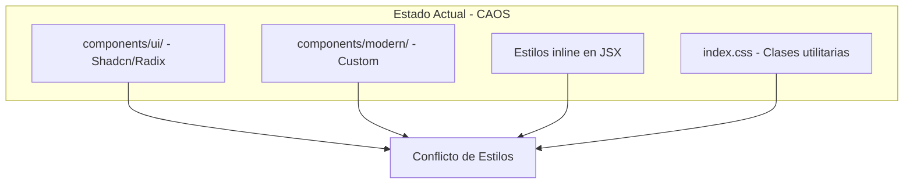
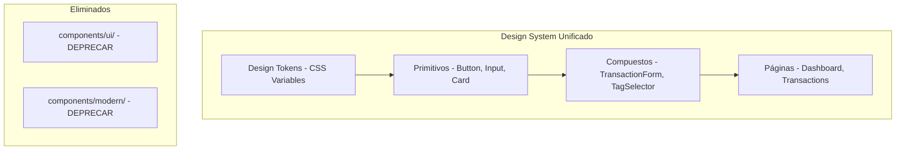

# 🎨 Plan de Estandarización de UI - Personal Finance App

## 📋 Resumen del Problema

Tu aplicación tiene **3 sistemas de componentes UI compitiendo** entre sí, lo que genera inconsistencias visuales y código duplicado:



---

## 🔍 Análisis de Inconsistencias Detectadas

### 1. **Componentes Button Duplicados**

| Archivo | Enfoque | Variantes | Problema |
|---------|---------|-----------|----------|
| [`components/ui/button.jsx`](../client/src/components/ui/button.jsx) | Shadcn + CVA | default, destructive, outline, secondary, ghost, link | Usa `hover:bg-blue-800` (azul) |
| [`components/modern/Button.jsx`](../client/src/components/modern/Button.jsx) | Custom props | primary, secondary, ghost, danger, outline | Usa `shadow-green-200` (verde) |
| Inline en JSX | Clases directas | N/A | `bg-primary hover:bg-pink-700` (rosa) |

**Resultado**: Botones con 3 colores diferentes (azul, verde, rosa) en la misma app.

### 2. **Componentes Card Duplicados**

| Archivo | Border Radius | Shadow | Hover |
|---------|---------------|--------|-------|
| [`components/ui/card.jsx`](../client/src/components/ui/card.jsx) | `rounded-2xl` | `shadow-lg` | `hover:shadow-xl` |
| [`components/modern/Card.jsx`](../client/src/components/modern/Card.jsx) | `rounded-xl` | `shadow-sm` | `hover:shadow-md` |
| Inline en JSX | `rounded-xl` o `rounded-2xl` | `shadow-sm` | Variable |

### 3. **Variables CSS vs Clases Hardcodeadas**

```css
/* index.css define variables */
--primary: 330 90% 46%;  /* Rosa #db0f79 */

/* Pero en componentes se usa: */
.btn-primary { @apply bg-primary hover:bg-pink-700 }  /* ✅ Correcto */
.btn-shadcn { hover:bg-blue-800 }                      /* ❌ Azul hardcodeado */
```

### 4. **Tokens de Diseño Inconsistentes**

| Token | index.css | modern/Card | ui/card | Inline |
|-------|-----------|-------------|---------|--------|
| Border color | `border-gray-200` | `border-card-border` | `border-border` | `border-gray-100` |
| Text muted | `text-gray-500` | `text-text-muted` | `text-muted-foreground` | `text-gray-400` |
| Spacing | `p-5`, `p-6` | `p-5` | `p-6` | Variable |

---

## ✅ Solución Propuesta: Design System Unificado

### Arquitectura Objetivo



### Estructura de Carpetas Propuesta

```
client/src/
├── design-system/
│   ├── tokens/
│   │   ├── colors.css          # Variables de color
│   │   ├── spacing.css         # Espaciado
│   │   ├── typography.css      # Tipografía
│   │   └── index.css           # Exporta todo
│   │
│   ├── primitives/
│   │   ├── Button/
│   │   │   ├── Button.jsx
│   │   │   ├── Button.stories.jsx  # Storybook (opcional)
│   │   │   └── index.js
│   │   ├── Card/
│   │   ├── Input/
│   │   ├── Badge/
│   │   ├── Modal/
│   │   └── index.js            # Barrel export
│   │
│   └── composites/
│       ├── TransactionRow/
│       ├── GoalCard/
│       ├── BalanceCard/
│       └── index.js
│
├── components/                  # Componentes de negocio
│   ├── TransactionForm.jsx
│   ├── TagSelector.jsx
│   └── ...
│
└── pages/
```

---

## 🎨 Design Tokens Propuestos

### Colores (Basados en tu index.css actual)

```css
/* design-system/tokens/colors.css */
:root {
  /* Brand */
  --color-primary: 330 90% 46%;        /* #db0f79 - Rosa */
  --color-primary-hover: 330 90% 40%;  /* Más oscuro */
  --color-primary-light: 330 90% 95%;  /* Fondo suave */
  
  /* Semantic */
  --color-success: 142 76% 36%;        /* Verde */
  --color-danger: 0 84% 60%;           /* Rojo */
  --color-warning: 38 92% 50%;         /* Ámbar */
  
  /* Neutral */
  --color-background: 340 10% 97%;
  --color-surface: 0 0% 100%;
  --color-border: 220 13% 91%;
  --color-text-primary: 340 30% 10%;
  --color-text-secondary: 215 16% 47%;
  --color-text-muted: 215 16% 60%;
}
```

### Espaciado

```css
/* design-system/tokens/spacing.css */
:root {
  --space-1: 0.25rem;   /* 4px */
  --space-2: 0.5rem;    /* 8px */
  --space-3: 0.75rem;   /* 12px */
  --space-4: 1rem;      /* 16px */
  --space-5: 1.25rem;   /* 20px */
  --space-6: 1.5rem;    /* 24px */
  --space-8: 2rem;      /* 32px */
  
  --radius-sm: 0.375rem;  /* 6px */
  --radius-md: 0.5rem;    /* 8px */
  --radius-lg: 0.75rem;   /* 12px */
  --radius-xl: 1rem;      /* 16px */
  --radius-2xl: 1.25rem;  /* 20px */
}
```

---

## 🧩 Componentes Primitivos Propuestos

### Button Unificado

```jsx
// design-system/primitives/Button/Button.jsx
import { cva } from 'class-variance-authority';
import { cn } from '@/lib/utils';

const buttonVariants = cva(
  // Base styles
  'inline-flex items-center justify-center gap-2 font-bold transition-all rounded-lg active:scale-[0.98] disabled:opacity-50 disabled:cursor-not-allowed',
  {
    variants: {
      variant: {
        primary: 'bg-primary text-white hover:bg-pink-700 shadow-md shadow-primary/20',
        secondary: 'bg-gray-100 text-foreground hover:bg-gray-200',
        ghost: 'bg-transparent hover:bg-primary/5 text-primary',
        danger: 'bg-red-500 text-white hover:bg-red-600',
        outline: 'border border-gray-200 bg-white hover:bg-gray-50 text-foreground',
      },
      size: {
        sm: 'h-8 px-3 text-xs',
        md: 'h-10 px-4 text-sm',
        lg: 'h-12 px-6 text-base',
        icon: 'h-10 w-10 rounded-full',
      },
    },
    defaultVariants: {
      variant: 'primary',
      size: 'md',
    },
  }
);

export function Button({ className, variant, size, children, icon, ...props }) {
  return (
    <button className={cn(buttonVariants({ variant, size }), className)} {...props}>
      {icon && <span className="material-symbols-outlined text-[18px]">{icon}</span>}
      {children}
    </button>
  );
}
```

### Card Unificado

```jsx
// design-system/primitives/Card/Card.jsx
import { cn } from '@/lib/utils';

export function Card({ className, interactive = false, children, ...props }) {
  return (
    <div
      className={cn(
        'bg-white border border-gray-200 rounded-xl shadow-sm',
        interactive && 'hover:shadow-md hover:border-primary/30 transition-all cursor-pointer',
        className
      )}
      {...props}
    >
      {children}
    </div>
  );
}

export function CardHeader({ className, children, ...props }) {
  return (
    <div className={cn('px-5 pt-5 pb-4', className)} {...props}>
      {children}
    </div>
  );
}

export function CardContent({ className, children, ...props }) {
  return (
    <div className={cn('px-5 pb-5', className)} {...props}>
      {children}
    </div>
  );
}

export function CardTitle({ className, children, ...props }) {
  return (
    <h3 className={cn('text-lg font-bold text-foreground', className)} {...props}>
      {children}
    </h3>
  );
}
```

### Input Unificado

```jsx
// design-system/primitives/Input/Input.jsx
import { cn } from '@/lib/utils';

export function Input({ className, icon, error, ...props }) {
  return (
    <div className="relative">
      {icon && (
        <div className="absolute inset-y-0 left-0 pl-3 flex items-center pointer-events-none">
          <span className="material-symbols-outlined text-gray-400 text-xl">{icon}</span>
        </div>
      )}
      <input
        className={cn(
          'w-full bg-white border rounded-xl text-foreground',
          'focus:outline-none focus:border-primary focus:ring-1 focus:ring-primary',
          'placeholder-gray-400 transition-all h-12',
          icon ? 'pl-10 pr-4' : 'px-4',
          error ? 'border-red-500' : 'border-gray-200',
          className
        )}
        {...props}
      />
    </div>
  );
}

export function InputLabel({ className, children, ...props }) {
  return (
    <label className={cn('text-gray-700 text-sm font-medium block mb-2', className)} {...props}>
      {children}
    </label>
  );
}
```

---

## 📋 Plan de Migración

### Fase 1: Preparación (Sin cambios visuales)

- [ ] Crear carpeta `design-system/`
- [ ] Mover tokens de `index.css` a archivos separados
- [ ] Crear componentes primitivos nuevos
- [ ] Agregar barrel exports

### Fase 2: Migración Gradual

- [ ] Reemplazar `components/ui/button.jsx` → `design-system/primitives/Button`
- [ ] Reemplazar `components/ui/card.jsx` → `design-system/primitives/Card`
- [ ] Reemplazar `components/modern/*` → Primitivos correspondientes
- [ ] Actualizar imports en páginas

### Fase 3: Limpieza

- [ ] Eliminar `components/ui/` (Shadcn)
- [ ] Eliminar `components/modern/`
- [ ] Eliminar clases CSS no usadas de `index.css`
- [ ] Actualizar `tailwind.config.js` para remover colores legacy

### Fase 4: Documentación

- [ ] Crear guía de uso de componentes
- [ ] Opcional: Configurar Storybook para visualizar componentes

---

## 🔧 Reglas de Estilo a Seguir

### ✅ HACER

```jsx
// Usar componentes del design system
import { Button, Card, Input } from '@/design-system/primitives';

// Usar variables CSS para colores
className="bg-primary text-primary-foreground"

// Usar tokens de espaciado consistentes
className="p-5 gap-4 rounded-xl"
```

### ❌ NO HACER

```jsx
// NO mezclar sistemas de componentes
import { Button } from '@/components/ui/button';      // ❌
import ModernButton from '@/components/modern/Button'; // ❌

// NO hardcodear colores
className="bg-pink-700"  // ❌ Usar bg-primary-hover
className="text-blue-500" // ❌ No existe en el design system

// NO usar valores arbitrarios
className="p-[23px]"  // ❌ Usar p-5 o p-6
```

---

## 📊 Impacto Esperado

| Métrica | Antes | Después |
|---------|-------|---------|
| Componentes Button | 3 | 1 |
| Componentes Card | 3 | 1 |
| Archivos CSS | 1 grande | 4 modulares |
| Consistencia visual | ~60% | ~95% |
| Tiempo de desarrollo nuevos componentes | Alto | Bajo |

---

## 🚀 Próximos Pasos

1. **Revisar y aprobar** este plan
2. **Crear los primitivos** en `design-system/`
3. **Migrar página por página** empezando por Dashboard
4. **Eliminar código legacy** una vez migrado

¿Te gustaría que proceda con la implementación de alguna fase específica?
